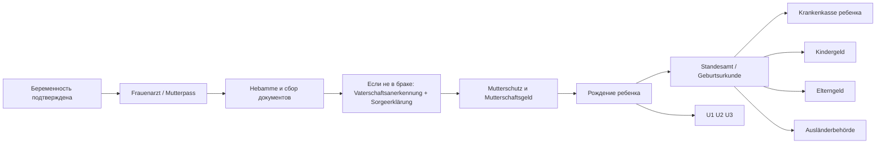
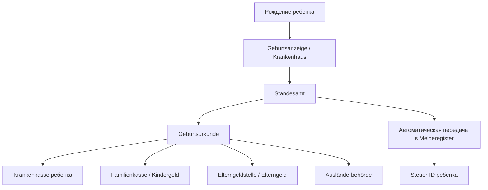

# Подробный пошаговый план для семьи, ожидающей первого ребёнка в Германии к декабрю 2026 года

## Исполнительное резюме

Если у семьи **нет гражданства Германии**, это само по себе **не мешает** беременности, родам, регистрации ребёнка, оформлению медицинской страховки ребёнку, а также получению части семейных выплат. На практике решающими становятся четыре вещи: **вид пребывания**, **право на работу**, **вид медицинской страховки** и **семейное положение родителей**. Для большинства “стандартных” случаев с **легальным проживанием, правом на работу и обычной страховкой** основной маршрут таков: встать на беременное наблюдение, открыть Mutterpass, заранее решить вопрос с Hebamme, вовремя уведомить работодателя, подготовить пакет для Standesamt, после рождения быстро оформить Geburtsurkunde, страхование ребёнка, Kindergeld, Elterngeld и при необходимости — вид на жительство ребёнку. citeturn33view0turn17view1turn34search1turn17view13turn10view2turn12view0turn26view0

Для семьи, ожидающей роды **в декабре 2026 года**, критические точки будут такие: **сейчас** — начать медицинское сопровождение и собрать документы родителей; **за 6 недель до ПДР** — старт Mutterschutz и подача на Mutterschaftsgeld; **примерно за 7 недель до начала Elternzeit** — уведомления работодателю; **в первую неделю после родов** — регистрация рождения и запуск страхования ребёнка; **в первые 3 месяца жизни ребёнка** — подача на Elterngeld; **в первые 6 месяцев** — не пропустить срок для rückwirkende выплаты Kindergeld. citeturn12view4turn12view5turn12view10turn17view13turn12view0turn26view4turn26view5

Для **неженатой пары** самый частый источник задержек — отсутствие заранее оформленных **Vaterschaftsanerkennung** и **Sorgeerklärung**. Для семей с иностранными документами второй частый источник задержек — отсутствие **оригиналов**, **присяжного перевода на немецкий** и, при необходимости, **Apostille/Legalisation**. Если хотя бы один из этих факторов у вас есть, разумно не ждать третьего триместра, а связаться со своим Standesamt и Jugendamt уже в ближайшие недели. citeturn17view11turn17view12turn18search2

Если у семьи статус **Aufenthaltsgestattung** или **Duldung**, обычные семейные выплаты сильно ограничены: Kindergeld и Elterngeld обычно не положены, **кроме Beschäftigungsduldung**. При этом беременность и роды могут покрываться по **AsylbLG**: для беременных и женщин после родов предусмотрены врачебная и сестринская помощь, Hebammenhilfe, лекарства, перевязочные и лечебные средства. Если же законного статуса и страхового покрытия нет, это уже не “обычный” семейный кейс, а ситуация, в которой нужно **срочно** подключать Schwangerschaftsberatung, миграционного юриста и социальную службу клиники. citeturn10view0turn10view1turn24search2

Важнейший практический вывод: не пытайтесь делать всё “после родов”. В Германии лучше работает обратная стратегия: **до родов** закрыть вопросы работодателя, отцовства/совместной опеки, документов иностранного происхождения, сценария Elterngeld/Elternzeit, страхового статуса ребёнка и порядка действий с Ausländerbehörde и Jugendamt. Тогда после рождения у семьи остаётся управляемый набор из нескольких коротких подач, а не перегрузка в первые дни с младенцем. citeturn34search9turn17view11turn18search2turn12view10turn26view0turn27search1

## Исходные допущения и главные риски

В этом отчёте я исхожу из того, что сегодня **21 апреля 2026 года**, семья ждёт первого ребёнка **примерно через 8 месяцев**, то есть ориентировочная дата родов — **середина декабря 2026 года**. Для практического планирования удобно взять условную ПДР **15 декабря 2026 года** и потом просто сдвинуть все сроки на вашу реальную дату из справки **“Zeugnis über den mutmaßlichen Tag der Entbindung”**. При такой ПДР стандартный Mutterschutz начнётся примерно **3 ноября 2026 года**. citeturn12view4turn12view5

Поскольку федеральная земля и город не указаны, ниже даны **общегерманские правила**, а там, где процедура зависит от земли или муниципалитета, я специально отмечаю: **“регионально отличается”**. Это особенно важно для Elterngeldstelle, детского сада/ясель, перечня документов для Standesamt при иностранном праве, а также для практики Ausländerbehörde по новорождённым детям иностранных граждан. citeturn26view7turn27search1turn18search2turn26view0

Главные риски в вашем сценарии — не медицинские, а **административно-правовые**. Они возникают, когда: у матери и/или отца иностранные документы без перевода или апостиля; родители не состоят в браке и не оформили признание отцовства; вид на жительство даёт неочевидные права на работу и пособия; мать находится в частной страховке или семейно застрахована у супруга; семья тянет с подачей на Elterngeld и Kindergeld; родители поздно выясняют местные правила на Kita/Kindertagespflege. citeturn18search2turn17view11turn10view0turn10view1turn12view6turn26view4turn27search1

## Дорожная карта семьи

Ниже — рабочий календарь для семьи с условной ПДР **15 декабря 2026 года**. Если у вас в вашей справке стоит другая дата, смещайте весь план соответственно. Я сознательно даю не только “что делать”, но и “зачем именно сейчас”, потому что в Германии несколько процедур связаны друг с другом: без Geburtsurkunde тормозится страховка ребёнка, без страхования и/или справок тормозятся выплаты, без признания отцовства у неженатой пары тормозится часть заявлений и запись данных в документы ребёнка. citeturn17view13turn17view11turn17view12turn12view0turn26view4

### Таблица календаря действий по месяцам

| Период | Что сделать | Практический результат |
|---|---|---|
| **Апрель 2026** | Найти Frauenarzt / Gynäkologe, открыть беременное наблюдение, получить Mutterpass; одновременно начать поиск Hebamme; проверить свой страховой статус и статус проживания; открыть отдельную папку “Беременность и ребёнок” для оригиналов, переводов и будущих заявлений. | У семьи появляется официальный старт медицинского сопровождения и база для всех последующих заявлений. |
| **Май 2026** | Если родители не женаты — оформить **Vaterschaftsanerkennung**, а при желании совместной опеки — **Sorgeerklärung**; если документы иностранные — написать/сходить в Standesamt и уточнить, какие именно оригиналы, переводы, апостили/легализации нужны именно вам. | Вы снижаете самый частый риск задержки Geburtsurkunde после родов. |
| **Июнь 2026** | Сценарно посчитать Elterngeld и Elternzeit: кто и когда будет дома, нужен ли Basiselterngeld, ElterngeldPlus, Partnermonate; если доход низкий — проверить Bürgergeld/Mehrbedarf für Schwangere, Kinderzuschlag и Wohngeld; если мать самозанятая — отдельно выяснить, есть ли у неё abgesicherter Krankengeld-/Krankentagegeld-канал. | К этой точке у семьи должен быть понятный финансовый и трудовой сценарий. |
| **Июль 2026** | Выбрать предполагаемое место родов; начать искать Kinderarzt для U3; отдельно спросить своё Jugendamt/городской портал, как в вашем месте подают на Kitaplatz: через центральный портал, напрямую в Kitas или через Gutschein-System. | Семья заранее понимает местную “карту маршрута”, а не выясняет её на фоне послеродовой нагрузки. |
| **Август 2026** | Сверить, какие документы уже готовы: паспорта, Aufenthaltstitel/eAT, свидетельства о рождении родителей, свидетельство о браке/разводе, переводы; если хотя бы чего-то нет — добрать сейчас. | Это последний по-настоящему удобный месяц закрыть бумажные пробелы без спешки. |
| **Сентябрь 2026** | Подготовить пакет для Mutterschaftsgeld; уточнить у Krankenkasse, как именно подавать заявление; если мать частно или семейно застрахована, проверить право на выплату через Bundesamt für Soziale Sicherung; если нужен вариант с ElterngeldPlus/частичной занятостью — обсудить график с работодателями заранее. | К началу Mutterschutz не будет задержек из-за неготовых документов. |
| **Октябрь 2026** | Если отец/второй родитель хочет Elternzeit **с даты рождения**, подать уведомление работодателю **примерно до конца октября 2026**; утвердить имя ребёнка и проверить, как оно будет отражаться по применимому праву; сделать финальную проверку папки для Standesamt. | Важный дедлайн для отца/второго родителя не будет пропущен. |
| **Ноябрь 2026** | С началом Mutterschutz подать на Mutterschaftsgeld; уведомить работодателя о ПДР, если это не сделано; перепроверить, кто и какими доверенностями сможет ходить в ведомства после родов; на случай раннего рождения держать шаблоны уведомлений готовыми. | До родов закрываются почти все “дородовые” бюрократические действия. |
| **Декабрь 2026** | После рождения: подтвердить имя ребёнка, получить/дозаказать нужное число Geburtsurkunden, запустить страхование ребёнка, Kindergeld, Elterngeld и при необходимости Aufenthaltserlaubnis ребёнку. | В первые дни после родов семья не теряет время на поиск алгоритма. |
| **Январь 2027** | Закончить Elterngeld-Antrag в пределах первых 3 Lebensmonate ребёнка; проверить, что Kindergeld-Antrag принят; если семья планирует ранний выход на работу — завершить заявки на Kita/Kindertagespflege. | Закрываются все основные выплаты и ранний childcare-план. |
| **Февраль 2027** | Если мать идёт в Elternzeit после Mutterschutz — проверить, что заявление работодателем получено и учтено; скорректировать семейный бюджет после первых выплат; подтвердить следующие U-Untersuchungen. | Семья входит в стабильный послеродовой режим с понятными выплатами и задачами. |

Этот календарь составлен на основе федеральных правил по Mutterschutz, Mutterschaftsgeld, Elterngeld, Kindergeld, регистрации рождения, автоматическому присвоению Steuer-ID, а также общих правил поиска childcare и прав на место с 1 года; локально порядок подачи на Kita и перечни документов Standesamt/Ausländerbehörde могут отличаться. citeturn12view4turn12view5turn12view10turn17view13turn18search2turn26view3turn26view4turn27search1turn17view9

### Чек-лист по неделям после родов

В **первую неделю** нужно считать приоритетом не всё подряд, а только четыре пункта: регистрация рождения через Standesamt по месту рождения, получение/заказ Geburtsurkunde, запуск страхования ребёнка и фиксация дедлайнов на Elterngeld/Kindergeld. Если ребёнок рождён в больнице или Geburtshaus, учреждение обычно передаёт Geburtsanzeige в Standesamt; при домашнем рождении родители должны представить Geburtsbescheinigung в течение недели. Если имя после родов ещё не выбрано, его нужно сообщить Standesamt в течение месяца. citeturn17view13turn21search6turn18search2

Во **вторую–третью неделю** лучше завершить: подачу в Krankenkasse на страхование ребёнка, запись/подтверждение U2 или U3, сбор пакета на Elterngeld и при необходимости подачу на Aufenthaltserlaubnis ребёнка, если хотя бы один из родителей — Drittstaatsangehöriger с Aufenthaltstitel. Steuer-ID ребёнку присваивается автоматически после первой регистрации; если письмо не пришло в течение 3 месяцев, номер можно запросить повторно через BZSt. citeturn17view5turn17view6turn26view0turn26view3

До конца **первых 3 Lebensmonate** ребёнка желательно подать Elterngeld, потому что оно выплачивается максимум за 3 прошедших Lebensmonate задним числом. Kindergeld тоже лучше запускать без промедления, хотя его можно заявить с rückwirkender выплатой до 6 месяцев. Если мать получает Mutterschaftsgeld и Arbeitgeberzuschuss, помните: для тех же недель после родов эти суммы засчитываются в Elterngeld, поэтому в первые недели Basiselterngeld у матери нередко либо не выплачивается, либо выплачивается частично. citeturn12view0turn26view4turn12view3

### Mermaid таймлайн общего процесса



Смысл этой схемы в том, что **Geburtsurkunde** является “узким горлышком” почти для всех послеродовых процедур, а для неженатых родителей ещё до родов нужно убрать второй узкий момент — вопрос правового отцовства и совместной опеки. citeturn17view13turn17view11turn17view12turn12view0turn26view4turn26view0

## Медицинское сопровождение матери и ребёнка

### Кого нужно найти и в какой последовательности

Практически всегда нужны четыре медицинских/околомедицинских контакта: **Frauenarzt / Gynäkologe**, **Hebamme**, выбранное место родов и **Kinderarzt** для первых послеродовых обследований. В немецкой системе Mutterpass выдаётся при первой Vorsorgeuntersuchung; он нужен не для ведомств, а для непрерывной медицинской информации о беременности и родах, поэтому его лучше всегда носить с собой. Почти все рутинные Vorsorgeuntersuchungen при нормально протекающей беременности могут выполнять и Hebammen, но ультразвук — это зона гинекологической практики. citeturn33view0turn17view1

### Что входит в базовую беременную помощь по Mutterschafts-Richtlinie

Базовая Vorsorge в Германии строится по Mutterschafts-Richtlinie и включает регулярные осмотры, консультации, наблюдение за развитием плода, выявление рисков, лабораторные исследования и УЗИ. В типичном течении беременности предусмотрены осмотры **каждые 4 недели**, а в последние два месяца — **каждые 2 недели**. В стандартную программу входят **три ультразвуковых исследования**, обычно примерно в третьем, шестом и восьмом месяце беременности. citeturn33view0turn36search0

Кроме УЗИ, в рутинный набор входят тесты и консультации по инфекциям и рискам беременности: предложение **HIV-теста**, исследование на **Schwangerschaftsdiabetes** в шестом–седьмом месяце, оценка **Rhesusfaktor**, а также предусмотренные Richtlinie обследования на **Chlamydien**, **Syphilis** и **Hepatitis B**. Для женщин младше 25 лет исследование на Chlamydien предлагается ежегодно и также при беременности. Важно, что пренатальные обследования в Германии являются **добровольными**: врач обязан объяснить цели, информативность и последствия, а беременная вправе отказаться. НПТ на трисомии 13, 18 и 21 не является рутинным скринингом и оплачивается GKV только в определённых ситуациях. citeturn33view0turn17view0turn17view4

Работодатель обязан отпускать беременную на необходимые Vorsorgeuntersuchungen, если невозможно получить своевременный приём вне рабочего времени; зарплату за это время сокращать нельзя. Поэтому с практической точки зрения беременность работодателю лучше сообщить не “в последний момент”, а как только семья готова начать пользоваться мерами Mutterschutz и освобождением на обследования. Одновременно с этим включается и реальная защита от увольнения, потому что для неё работодателю нужно знать о беременности. citeturn34search5turn34search1turn34search4

### Что нужно помнить после рождения ребёнка

Сразу после рождения идут **U1**, затем **U2** с 3-го по 10-й день жизни и **U3** на 4–5-й неделе. По сути, U1/U2 — это “медицинский запуск” жизни ребёнка, а U3 — первая важная амбулаторная проверка развития, органов и тазобедренных суставов. Поэтому уже в третьем триместре разумно подобрать Kinderarzt, чтобы окно для U3 не сорвалось. В роддоме родители получают **gelbes Kinderuntersuchungsheft**, и его дальше нужно беречь так же внимательно, как Mutterpass во время беременности. citeturn17view5turn17view6

## Документы, ведомства и регистрация ребёнка

### Что делается до родов, чтобы после родов не было блокировок

Если родители состоят в браке, путь проще: после Anmeldung der Geburt отец обычно вносится в документы автоматически. Если родители **не женаты**, отцу нужно до рождения или после рождения оформить **Vaterschaftsanerkennung**; для совместной опеки отдельно нужна **Sorgeerklärung**. С практической точки зрения выгоднее сделать обе процедуры **до родов**: тогда меньше риск, что придётся переоформлять Geburtsurkunde или ждать, пока ведомства признают правовой статус отца. citeturn17view11turn17view12turn7search2

У семей с иностранными документами ключевое правило такое: **не исходите из “общего списка”**, а заранее спрашивайте ваш конкретный Standesamt, что нужно именно в вашей ситуации. Общая практика такова: нужны **оригиналы** документов родителей, иностранные документы — с **переводом присяжного переводчика**, а для части стран дополнительно требуется **Apostille или Legalisation**. Если мать ранее состояла в браке, Standesamt может требовать не только свидетельство о браке, но и документ о его прекращении. citeturn18search2turn17view15

### Как работает регистрация рождения и Geburtsurkunde

Рождение регистрируется в **Standesamt по месту рождения ребёнка**, а не по месту жительства родителей. Если ребёнок родился в больнице, Geburtshaus или Geburtsklinik, учреждение обычно передаёт данные в Standesamt; при домашнем рождении родители обязаны представить Geburtsbescheinigung в течение недели. Geburtsurkunde будет нужна как минимум для Elterngeld, Mutterschaftsgeld и Krankenkasse ребёнка. Федеральные и муниципальные сервисные страницы также указывают, что обычно выдают **3 бесплатные целевые Geburtsurkunden**: для Kindergeld, Elterngeld и Krankenkasse; дополнительные экземпляры для личных нужд — платные. citeturn17view13turn18search2turn18search3

После регистрации рождения Standesamt обычно передаёт данные в реестр жителей автоматически; в федеральных/муниципальных сервисах прямо указано, что новорождённого обычно не нужно отдельно “прописывать” как обычный Umzug-Fall. Одновременно у ребёнка после первой регистрации автоматически создаётся **Steuer-ID**; если письмо не пришло в течение трёх месяцев, её можно запросить повторно в BZSt. citeturn17view13turn25search14turn26view3

### Как оформить страховку ребёнка и что с видом на жительство

Для ребёнка вопрос страховки нужно запускать **сразу после рождения**, как только у вас есть хотя бы базовый пакет документов. В GKV ребёнок часто включается в **Familienversicherung** одного из родителей с даты рождения, если соблюдены условия; но есть важное исключение, когда другой родитель состоит не в GKV, а, например, в PKV, и его доход устойчиво выше и превышает порог обязательного страхования. Поэтому для смешанных GKV/PKV-семей вопрос нужно проверить до родов со своей Krankenkasse, а не после. citeturn17view8turn20search0turn20search1

Если хотя бы один родитель — гражданин третьей страны и имеет Aufenthaltstitel, для ребёнка, рождённого в Германии, **как правило** можно оформить Aufenthaltserlaubnis. Здесь федеральный ориентир даёт BAMF, но практический порядок подачи и компетентный орган могут отличаться по месту жительства. Поэтому после рождения и получения Geburtsurkunde не откладывайте контакт с вашей Ausländerbehörde. Если у родителей нет внятного законного статуса, этот вопрос нужно вести уже не “по шаблону”, а с миграционным юристом. citeturn26view0turn26view1

### Таблица инстанций, контактов и документов

| Инстанция | Зачем обращаться | Когда | Что обычно готовить |
|---|---|---|---|
| **Frauenarzt / Gynäkologe** | Беременное наблюдение, Mutterpass, справка о ПДР | Сразу после подтверждения беременности | Страховая карта, паспорт/удостоверение, при наличии старые анализы |
| **Hebamme** | До- и послеродовое сопровождение, часть Vorsorge и Wochenbett | Как можно раньше в беременности | Страховые данные, ПДР, контактные данные |
| **Работодатель** | Уведомление о беременности, Mutterschutz, Elternzeit | Как только вы хотите активировать меры защиты; для Elternzeit — по дедлайнам | Справка о ПДР, заявление на Elternzeit |
| **Krankenkasse** | Mutterschaftsgeld, страхование ребёнка | До и сразу после родов | Заявление, справка о ПДР, потом Geburtsurkunde ребёнка |
| **Bundesamt für Soziale Sicherung** | Mutterschaftsgeld для частно/семейно застрахованной работающей матери | До родов и после родов | ПДР, данные страховки, занятости, Steuer-ID, банковские реквизиты |
| **Standesamt** | Регистрация рождения, Geburtsurkunde | В течение 1 недели после рождения | Geburtsanzeige/Geburtsbescheinigung, паспорта, свидетельства о рождении родителей, брак/развод, переводы, апостиль/легализация, Vaterschaftsanerkennung/Sorgeerklärung при необходимости |
| **Familienkasse** | Kindergeld | После рождения, лучше без задержки | Kindergeld-Antrag, Steuer-ID родителей и ребёнка, банковские данные |
| **Elterngeldstelle** | Elterngeld | Только после рождения, лучше в первые 3 Lebensmonate | Заявление, Geburtsurkunde, данные о доходе, Mutterschaftsgeld, сведения о занятости/Elternzeit |
| **Jugendamt** | Vaterschaftsanerkennung, Sorgeerklärung, Kitaplatz/Kindertagespflege, социальные консультации | До родов и далее по childcare-плану | Паспорта, документы родителей, Mutterpass/данные ребёнка, иногда подтверждение занятости родителей |
| **Ausländerbehörde** | Aufenthaltstitel ребёнка | После получения Geburtsurkunde | Паспорт(ы), Aufenthaltstitel родителей, Geburtsurkunde ребёнка, фото/анкеты по местным правилам |
| **Kinderarzt** | U2/U3 и дальнейшие U-Untersuchungen | Сразу после рождения / заранее запись ещё в беременности | Данные ребёнка, страховка, gelbes Heft |

По федеральным и официальным сервисным источникам важнейшие точки таковы: Standesamt — в течение недели; Elterngeld — после рождения, лучше в первые 3 Lebensmonate; Kindergeld — через Familienkasse с указанием Steuer-ID; правая часть документов для иностранных родителей зависит от личной ситуации и местного Standesamt; при отсутствии брака и желании совместной опеки критичны Jugendamt-процедуры до родов. Общая административная справка по ведомствам доступна через **115**, а по Kindergeld есть бесплатная линия BA **0800 4 555530**. citeturn17view13turn18search2turn12view0turn26view4turn26view5turn17view11turn17view12turn18search3

### Mermaid-схема регистрации и оформления пособий



На практике это означает, что **сначала** нужно обеспечить правильную регистрацию рождения и получение Geburtsurkunde, а уже **потом** запускать большую часть выплат и иммиграционных процедур ребёнка. Исключение — только дородовые вопросы матери: Mutterschutz, Mutterschaftsgeld и уведомления работодателю. citeturn17view13turn12view5turn26view4turn26view0

## Выплаты, отпуск и права на работе

### Таблица сравнения пособий и выплат

| Выплата | Кто ведёт | Кто обычно имеет право | Размер и длительность | Ключевой дедлайн | Особенности для неграждан |
|---|---|---|---|---|---|
| **Kindergeld** | Familienkasse при Bundesagentur für Arbeit | Родители/лица, имеющие право по налоговым правилам и статусу пребывания | **259 евро в месяц на ребёнка**; с рождения, обычно минимум до 18 лет | Подать как можно раньше; rückwirkend максимум **6 месяцев** | Для иностранных граждан право зависит не от гражданства ребёнка, а прежде всего от статуса родителя; при Aufenthaltsgestattung/Duldung обычно нет, кроме Beschäftigungsduldung |
| **Elterngeld** | Elterngeldstelle земли/места жительства ребёнка | Родители, которые живут с ребёнком, сами ухаживают за ним и отвечают условиям по доходу/рабочему времени/статусу | Basiselterngeld обычно **300–1 800 евро/мес**, как правило **65%** утраченного нетто; ElterngeldPlus — в половинном размере, но дольше; общий предел дохода для рождений с 01.04.2025 — **175 000 евро zu versteuerndes Einkommen** | Подавать только **после рождения**, лучше в первые **3 Lebensmonate** | Право у иностранных родителей зависит от “устойчивого” законного пребывания и права на работу; при Aufenthaltsgestattung/Duldung обычно нет, кроме Beschäftigungsduldung |
| **Mutterschaftsgeld** | Krankenkasse или Bundesamt für Soziale Sicherung | Работающие матери в зависимости от вида страховки и занятости | В GKV — до **13 евро/день** от кассы + Zuschuss работодателя до среднего нетто; обычно за **6 недель до** и **8 недель после** родов; в особых случаях **12 недель после**. Через BAS — максимум **210 евро** единовременно для частно/семейно застрахованных работающих | Подавать, как только выдана справка о ПДР; после рождения дослать Geburtsurkunde | Право зависит не от гражданства, а от комбинации занятости и страхового статуса; без страхования и без подходящего статуса выплаты могут отсутствовать |

Источники по таблице: Kindergeld — Familienportal и BA; Elterngeld — Familienportal по суммам, срокам и доходным границам; Mutterschaftsgeld — Familienportal, BMG и BAS. citeturn10view2turn26view4turn26view5turn12view2turn10view3turn12view0turn10view0turn12view5turn17view7turn12view7turn12view9

### Подробные шаги по оформлению “декретного” отпуска для жены

Для наёмной работницы в Германии “декрет” фактически складывается из трёх разных блоков: **Mutterschutz**, **Mutterschaftsgeld** и затем, при желании, **Elternzeit**. Это не одно заявление, а три разных правовых режима. Mutterschutz в стандартном случае начинается за **6 недель до предполагаемой даты родов** и заканчивается через **8 недель после родов**; при Frühgeburt или Mehrlingen послеродовая часть составляет **12 недель**, а при рождении ребёнка с инвалидностью её можно продлить до 12 недель по заявлению в Krankenkasse. citeturn12view4turn9search1turn34search14

**Шаг для жены сейчас:** сообщить работодателю о беременности и ПДР, как только семья готова пользоваться мерами защиты. Формально момент сообщения выбирает сама работница, но чем раньше работодатель узнаёт о беременности, тем раньше он обязан организовать mutterschutzgerechte условия труда; кроме того, реальная защита от увольнения работает только когда работодатель знает о беременности. citeturn34search1turn34search4

**Следующий шаг:** взять у врача или у Hebamme справку **“Zeugnis über den mutmaßlichen Tag der Entbindung”**. Это ключевой документ для Mutterschaftsgeld. Если мать состоит в GKV и работает, она подаёт заявление в свою Krankenkasse; после рождения ребёнка нужно дослать **Geburtsurkunde**, чтобы выплата продолжилась на послеродовой период. citeturn12view5

**Как считается выплата:** если мать состоит в GKV и её средний нетто-доход превышает **13 евро в день**, то Krankenkasse платит максимум **13 евро в день**, а работодатель обязан доплатить разницу до среднего дневного нетто за последние 3 расчётных календарных месяца перед началом Mutterschutzfrist. Практически это означает, что в нормальном кейсе семья во время Mutterschutz получает сумму, близкую к обычному нетто заработку матери. citeturn34search11turn17view7

**Пример расчёта:** если усреднённый чистый месячный доход жены до Mutterschutz составлял около **2 400 евро**, то ориентировочный календарный дневной нетто-показатель будет около **80 евро**. Из него **13 евро/день** выплатит Krankenkasse, а примерно **67 евро/день** — работодатель как Zuschuss. Точная бухгалтерская сумма зависит от фактического среднего заработка, реальной даты родов и того, была ли беременность доношенной, многоплодной или преждевременной. Этот пример нужен только как практический ориентир логики расчёта. citeturn34search11turn17view7

Если мать **частно застрахована** или **семейно застрахована** и при этом работает, у неё может быть право на Mutterschaftsgeld через **Bundesamt für Soziale Sicherung**, но там речь идёт о выплате максимум **210 евро** единовременно; при этом Zuschuss работодателя всё равно может быть актуален, если условия занятости соблюдены. Если мать не работает и не имеет подходящего страхового/трудового статуса, обычного Mutterschaftsgeld может не быть. citeturn12view6turn12view7turn12view9turn23search7

Если работодатель или врач вводит **индивидуальный Beschäftigungsverbot** ещё до обычного Mutterschutz, включается не Mutterschaftsgeld, а **Mutterschutzlohn**: работнице нужно быстро передать работодателю медицинское заключение с периодом и объёмом ограничения. Это отдельный механизм и его не стоит путать с “обычным декретом”. citeturn9search5turn13search10

После послеродовой части Mutterschutz мать может уйти в **Elternzeit**. Для матери Familienportal прямо указывает: если Elternzeit должна начаться сразу после стандартной послеродовой Schutzfrist, достаточно сообщить работодателю **не позднее чем за 7 недель до конца этой Schutzfrist**. При условной дате родов 15 декабря 2026 года и стандартной 8-недельной послеродовой защите это значит, что безопасно подготовить и отправить заявление уже в **первую неделю после рождения**. citeturn12view10

### Что должен сделать отец или второй родитель

Если отец/второй родитель хочет уйти в **Elternzeit с самого рождения ребёнка**, подать заявление работодателю нужно **примерно за 7 недель до ожидаемой даты родов**. При условной ПДР 15 декабря 2026 года это ориентир около **27 октября 2026 года**. Если родители не женаты и отец/второй родитель планирует Elterngeld, нужно заранее подготовить доказательство признания отцовства, потому что для Elterngeld это отдельный обязательный блок документов. citeturn12view10turn17view12

Elternzeit и Elterngeld — это **не одно и то же**. Elternzeit — право на освобождение от работы; Elterngeld — денежная выплата. Elterngeld можно получать и без Elternzeit, но во время получения Elterngeld работать можно не более **32 часов в неделю**. Если родители хотят более длинный период частичной занятости, нужно смотреть на ElterngeldPlus; при одновременной работе обоих родителей в диапазоне **24–32 часов** возможен Partnerschaftsbonus на 2, 3 или 4 последовательных Lebensmonate. citeturn35search1turn35search0turn35search4

### Что важно по Elterngeld именно для семьи с декабрьскими родами

Elterngeld подаётся **только после рождения ребёнка**, и лучше сделать это в первые **3 Lebensmonate**, потому что выплата идёт максимум за 3 прошедших Lebensmonate. Для рождений с 1 апреля 2025 года действует общая Einkommensgrenze **175 000 евро** налогооблагаемого дохода в календарном году до рождения. Базовый диапазон — **300–1 800 евро в месяц**, а стандартная ставка замещения обычно составляет **65%** утраченного нетто-дохода. citeturn12view0turn10view3turn12view2

Для типичной работающей матери нужно помнить ещё одно: **Mutterschaftsgeld и Arbeitgeberzuschuss засчитываются в Elterngeld за те же недели**. Поэтому если ребёнок родился, например, в середине декабря, то в первом Lebensmonat Basiselterngeld у матери часто будет ноль, а во втором — только частичный остаток месяца после окончания послеродовой защиты. Это не ошибка ведомства, а нормальная логика немецкой системы. citeturn12view3

### Низкий доход, временные трудности и дополнительные выплаты

Если у семьи невысокие доходы, кроме трёх “больших” выплат стоит проверить ещё **Kinderzuschlag**, а также в зависимости от кейса **Wohngeld** или Bürgergeld. Kinderzuschlag с 1 января 2025 года составляет до **297 евро в месяц на ребёнка** и может открывать доступ к **освобождению от Kita-Gebühren** и мерам **Bildung und Teilhabe**. Для беременных в Bürgergeld предусмотрен дополнительный **Mehrbedarf 17%** с 13-й недели беременности. citeturn31search0turn24search4

Если мать **самозанятая**, то обычный Mutterschutz по трудовому праву на неё в чистом виде не распространяется, а денежная защита зависит от того, есть ли у неё отдельно обеспеченный **Krankengeld-/Krankentagegeld-Anspruch**. Для добровольно застрахованных в GKV семей это обычно означает, что нужно заранее проверить опцию Krankengeld; для PKV — наличие и условия Krankentagegeld. Если этого нет, рассчитывать на автоматическую “декретную” схему как у наёмной сотрудницы нельзя. citeturn37view0

## Ясли, ранний уход и региональные различия

Для ребёнка **до 1 года** право на место в Betreuung зависит от ситуации семьи: например, оно может быть связано с тем, что родители работают, ищут работу, учатся или что Betreuung нужна для развития ребёнка. Начиная **с полного 1 года**, в Германии действует **правовой Anspruch** на место в Kita или в Kindertagespflege. При этом Kindertagespflege — это не “второсортная альтернатива”, а юридически признанная форма ухода, особенно типичная для детей до 3 лет. citeturn17view9turn27search0

Главная практическая проблема здесь не в праве как таковом, а в том, что **процедуры подачи резко отличаются по городам и землям**. Familienportal прямо указывает: где-то есть центральное электронное распределение, где-то — только прямые заявки в конкретные Kitas, а в большинстве муниципалитетов опорной точкой остаётся **Jugendamt**. Поэтому в вашем сценарии правильная тактика не “искать садик потом”, а уже в беременности выяснить у Jugendamt: есть ли единый портал, нужен ли Kita-Gutschein, можно ли делать Vormerkung до рождения, какие очереди по нужному району и что считается доказательством Bedarf до 1 года. citeturn27search1turn27search3turn27search5turn30search0

При зачислении в Betreuung почти наверняка потребуется **Masernschutz-Nachweis**. Федеральное министерство здравоохранения прямо указывает, что подтверждением может быть **Impfausweis**, **gelbes Kinderuntersuchungsheft** или врачебная справка; обычно доказательство предъявляется руководству учреждения. Это не “крайний шаг”, а обязательная часть допуска в Betreuung. citeturn17view10

По оплате ситуация тоже региональная, но федеральный Familienportal подчёркивает две вещи. Первая: родительские взносы во многих местах **социально градуируются** по доходу, числу детей и объёму Betreuung. Вторая: если семья получает Kinderzuschlag, Wohngeld, Arbeitslosengeld, SGB II/SGB XII или AsylbLG, от родительских взносов за Kita часто можно быть освобождённым, а по линии Bildung und Teilhabe возможно также финансирование отдельных расходов, например питания или мероприятий. citeturn27search3turn27search4turn31search0

Практически для семьи с декабрьскими родами это означает следующее. Если возвращение на работу планируется **к первому дню рождения ребёнка или раньше**, уже летом–осенью 2026 года выясните местную систему, а после рождения сразу внесите данные ребёнка в местный portal/Vormerkliste или подайте прямые заявки в Kitas. Если к нужной дате место не найдено, важно вести всё **письменно**: подтверждения подач, отказы, письма в Jugendamt. Именно этот набор документов потом нужен, если семья будет добиваться места по праву или просить альтернативу в Kindertagespflege. citeturn17view9turn27search1turn27search5

## Приложения и большая памятка

### Таблица вариантов статуса проживания и влияния на права

| Статус семьи | Kindergeld | Elterngeld | Медицинская беременная помощь | Ключевой комментарий |
|---|---|---|---|---|
| **Законное пребывание с полноценным правом на работу**: Niederlassungserlaubnis, Daueraufenthalt-EU, Blaue Karte EU, часть Aufenthaltserlaubnis с правом работать ≥ 6 месяцев | Обычно да | Обычно да | По обычным правилам страховки | Это самый “нормальный” семейный кейс; важно смотреть страховой статус и доход |
| **Временный законный титул, но с ограниченными правами на работу** | Зависит от типа титула; при титуле только для учёбы/обучения Kindergeld обычно нет | Зависит от того, считается ли пребывание устойчивым и есть ли необходимое право на работу | По вашему страховому статусу | Нужна индивидуальная проверка титула до рождения ребёнка |
| **Aufenthaltsgestattung / Duldung** | Обычно нет | Обычно нет | При получении AsylbLG беременность и роды покрываются: врачебная помощь, Hebammenhilfe, лекарства и средства ухода | Исключение — **Beschäftigungsduldung** |
| **Beschäftigungsduldung** | Может быть да | Может быть да | По применимым социальным/медицинским правилам | Это специально указанное официальное исключение из общего запрета |
| **Отсутствие законного статуса / нет внятного страхового покрытия** | Регулярные семейные выплаты обычно недоступны | Регулярные семейные выплаты обычно недоступны | Нужна срочная индивидуальная правовая и социальная проверка | Это точка, где стандартные шаблоны больше не работают |

Официальная база для этой таблицы — Familienportal по Elterngeld и Kindergeld для иностранных родителей, а также BMAS по AsylbLG для беременных и BAMF по вопросу Aufenthaltserlaubnis ребёнка при наличии титула у родителя. По строке “без статуса” формулировка “обычно недоступны” — это аккуратный вывод из того, что официальный перечень оснований для Kindergeld/Elterngeld такие случаи не включает. citeturn10view0turn10view1turn24search2turn26view0

### Когда обязательно идти за индивидуальной юридической консультацией

Юрист по миграционному праву или хорошая Schwangerschaftsberatung нужны **обязательно**, если: у родителей нет действующего Aufenthaltstitel; один из родителей за границей или не может лично прийти на признание отцовства; у матери сложная история браков/разводов; документы родителей выданы за рубежом и неясно, нужна ли Apostille/Legalisation; один из родителей в PKV, другой в GKV и непонятно, куда страховать ребёнка; семье отказали в Elterngeld/Kindergeld из-за типа титула; к первому дню рождения не дали место, несмотря на своевременные заявки. citeturn18search2turn17view11turn17view8turn10view0turn10view1turn17view9

### Официальные ресурсы и куда смотреть в первую очередь

- **entity["organization","Bundesministerium für Familie, Senioren, Frauen und Jugend","german family ministry"] / Familienportal** — главный федеральный вход по Elterngeld, Elternzeit, Kindergeld, Mutterschutz, checklists, “Beratung vor Ort” и ссылкам на формы по всем землям. Телефон сервиса Familienportal: **030 201 791 30**. citeturn26view7turn37view0  
- **entity["organization","Bundesagentur für Arbeit","german employment agency"] / Familienkasse** — Kindergeld, формы, eServices, горячая линия **0800 4 555530**. citeturn26view4turn26view5  
- **entity["organization","Bundesministerium für Gesundheit","german health ministry"]** — официальные материалы по Schwangerschaftsvorsorge, GKV, Masernschutz и гражданским вопросам здравоохранения. citeturn32view5turn17view8turn17view10  
- **entity["organization","Gemeinsamer Bundesausschuss","german healthcare council"]** — Mutterschafts-Richtlinie и график/содержание обследований, U-Untersuchungen детей. citeturn33view0turn17view6  
- **entity["organization","Bundesamt für Soziale Sicherung","german social security agency"]** — Mutterschaftsgeld для частно или семейно застрахованных работающих женщин; подача и перечень данных. citeturn12view7turn12view8turn12view9  
- **entity["organization","Bundeszentralamt für Steuern","german tax authority"]** — автоматическая Steuer-ID новорождённому и повторный запрос, если письмо не пришло в течение 3 месяцев. citeturn26view3  
- **entity["organization","Bundesamt für Migration und Flüchtlinge","german migration agency"]** — федеральные ориентиры по Aufenthaltstitel семьи и ребёнка. citeturn26view0  
- **Bundesportal / 115** — общий ориентир по административным услугам Bund/Länder/Kommunen и навигация к нужному ведомству. citeturn18search2turn18search3  

### Образцы писем и заявлений

#### Шаблон уведомления работодателю о беременности

```text
Betreff: Mitteilung meiner Schwangerschaft und des voraussichtlichen Entbindungstermins

Sehr geehrte/r [Name],

hiermit teile ich Ihnen mit, dass ich schwanger bin.
Der voraussichtliche Entbindungstermin ist der [Datum].

Die ärztliche / hebammengeleitete Bescheinigung über den mutmaßlichen Tag der Entbindung
füge ich bei / reiche ich kurzfristig nach.

Bitte berücksichtigen Sie die gesetzlichen Mutterschutzvorschriften bei der weiteren Einsatzplanung.
Ich bitte außerdem um kurze Bestätigung des Eingangs dieser Mitteilung.

Mit freundlichen Grüßen
[Vorname Nachname]
[Abteilung / Personalnummer]
[Datum]
```

#### Шаблон заявления на Elternzeit для отца или второго родителя с даты рождения

```text
Betreff: Anmeldung der Elternzeit ab Geburt unseres Kindes

Sehr geehrte/r [Name],

hiermit melde ich Elternzeit für mein Kind an.

Geplanter Beginn der Elternzeit: ab Geburt des Kindes
Voraussichtlicher Entbindungstermin: [Datum]
Geplantes Ende der Elternzeit: [Datum]

Bitte bestätigen Sie mir den Eingang dieser Anmeldung schriftlich.

Mit freundlichen Grüßen
[Vorname Nachname]
[Datum]
```

#### Шаблон заявления на Elternzeit для матери после окончания Mutterschutz

```text
Betreff: Anmeldung der Elternzeit im Anschluss an die Mutterschutzfrist

Sehr geehrte/r [Name],

hiermit melde ich Elternzeit für mein Kind im Anschluss an die Mutterschutzfrist an.

Voraussichtlicher Entbindungstermin: [Datum]
Geplanter Beginn der Elternzeit: unmittelbar nach Ende der Mutterschutzfrist
Geplantes Ende der Elternzeit: [Datum]

Bitte bestätigen Sie mir den Eingang dieser Anmeldung schriftlich.

Mit freundlichen Grüßen
[Vorname Nachname]
[Datum]
```

#### Шаблон письма в Jugendamt / Kitastelle при отсутствии места

```text
Betreff: Bitte um Vermittlung / Nachweis eines Betreuungsplatzes ab [Datum]

Sehr geehrte Damen und Herren,

für unser Kind [Name, Geburtsdatum] benötigen wir ab dem [Datum] einen Betreuungsplatz
in einer Kita oder in der Kindertagespflege.

Wir haben uns bereits bei folgenden Einrichtungen / über folgendes Portal beworben:
[перечень заявок, даты, номера]

Da bisher kein Platz angeboten wurde, bitte ich um
1) Mitteilung des aktuellen Bearbeitungsstands,
2) Vermittlung eines zumutbaren Betreuungsplatzes ab [Datum] oder
3) schriftliche Bestätigung, dass derzeit kein Platz verfügbar ist.

Mit freundlichen Grüßen
[Vorname Nachname]
[Adresse]
[Telefon / E-Mail]
[Datum]
```

### Большая памятка

**Сделать до родов**

- Встать на наблюдение, получить **Mutterpass** и расписание обследований. citeturn33view0turn17view1turn36search0  
- Найти **Hebamme** и определить формат до-/послеродового сопровождения. citeturn17view0turn33view0  
- Проверить страховой статус матери и будущий страховой статус ребёнка, особенно если один родитель в PKV. citeturn17view8turn20search1  
- Если родители не женаты — оформить **Vaterschaftsanerkennung**, а если нужна совместная опека — ещё и **Sorgeerklärung**. citeturn17view11turn17view12  
- Собрать оригиналы документов родителей; для иностранных документов — переводы и, если нужно, апостиль/легализация. citeturn18search2  
- Сообщить работодателю о беременности и ПДР; подготовить подачу на Mutterschaftsgeld. citeturn34search1turn12view5  
- Решить сценарий **Elternzeit/Elterngeld** для обоих родителей; если отец хочет быть дома с рождения — не пропустить 7-недельный дедлайн к работодателю. citeturn12view10turn12view2  
- Узнать у **Jugendamt** локальные правила для Kitaplatz/Kindertagespflege. citeturn27search1turn27search5  

**Сделать в день родов и в роддоме**

- Уточнить, кто и как передаст **Geburtsanzeige** в Standesamt. citeturn17view13turn18search2  
- Утвердить имя ребёнка так, как оно должно быть внесено в немецкие документы. citeturn21search6  
- Получить информацию по U1/U2, gelbes Heft и выписке. citeturn17view5turn17view6  

**Сделать в первую неделю после родов**

- Закончить регистрацию рождения и заказать/получить **Geburtsurkunde**. citeturn17view13turn18search2  
- Подать ребёнка в **Krankenkasse**. citeturn17view13turn20search0turn20search1  
- Подать на **Kindergeld** или как минимум подготовить заявление и Steuer-ID-данные. citeturn26view4turn26view5turn26view3  
- Собрать пакет на **Elterngeld**. citeturn12view0turn12view2  
- Если нужен Aufenthaltstitel ребёнку — запустить процедуру в **Ausländerbehörde**. citeturn26view0turn26view1  

**Сделать в первые 3 месяца жизни ребёнка**

- Подать **Elterngeld**, иначе потеряете часть rückwirkende выплаты. citeturn12view0  
- Подтвердить U2/U3 и дальнейший график U-Untersuchungen. citeturn17view5turn17view6  
- Проверить, пришла ли **Steuer-ID** ребёнка; если нет в течение 3 месяцев — запросить повторно через BZSt. citeturn26view3  
- При низком доходе проверить **Kinderzuschlag**, Wohngeld, Bürgergeld/Mehrbedarf и льготы на Kita. citeturn31search0turn24search4turn27search3  

**Сделать до первого дня рождения ребёнка**

- Если нужен childcare — не упустить местную процедуру **Kitaplatz** или **Kindertagespflege**. citeturn17view9turn27search0turn27search1  
- Подготовить **Masernschutz-Nachweis** для допуска в Betreuung. citeturn17view10  
- Если место не дали, всё общение с Jugendamt вести письменно. citeturn17view9turn27search1  

**Запомнить как “красные флажки”**

- Нет действующего статуса или страхового покрытия. citeturn10view0turn10view1turn24search2  
- Иностранные документы без перевода/апостиля. citeturn18search2  
- Неженатая пара без признания отцовства. citeturn17view11turn17view12  
- Отец хочет Elternzeit с рождения, но заявление работодателю не подано вовремя. citeturn12view10  
- Семья ждёт Elterngeld “сама собой”, не подав заявление после родов. citeturn12view0  
- Семья считает, что в ребёнка автоматически “всё перенесётся” по миграционному статусу родителей без отдельной проверки. citeturn26view0turn26view1